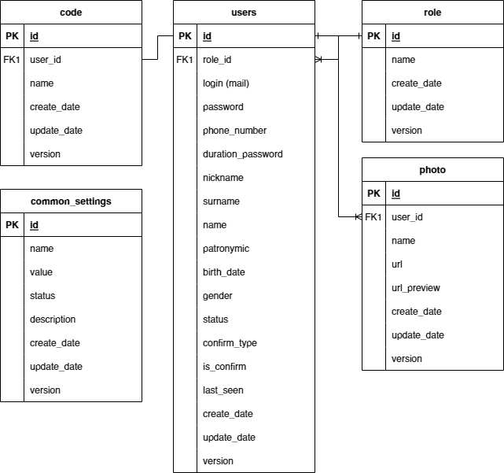

= Руководство администратора

== База данных:
В приложение используется база данных - https://www.postgresql.org/[PostgreSQL], ER-модель которой выглядит следующим образом:

== Генерация SQL-патча для Liquibase
Генерация SQL-патча осуществляется командой
[source, text]
----
gradlew createPatch -Ppatchname=create_user_table -Ptype=DML -Ppatchversion=01.000.00
----

Описание аргументов:

. *patchname* - Логическое наименование патча (Например: create_user_table)
. *type* - Тип патча (*Опциональный параметр*)
    - *DDL* (SELECT, INSERT, UPDATE, DELETE)
    - *DML* (CREATE, ALTER, DROP)
. *patchversion* - Указание расположения патча (*Опциональный параметр*)